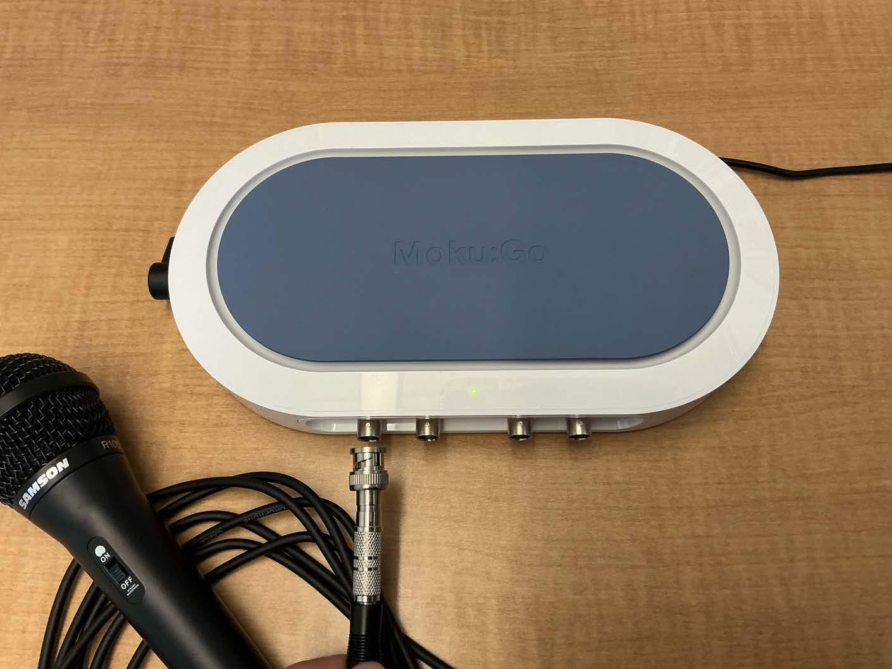
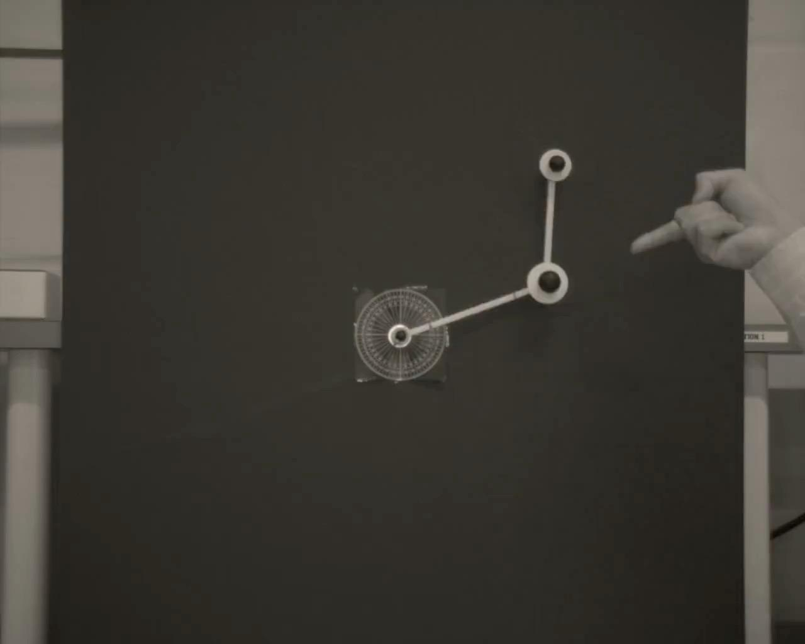
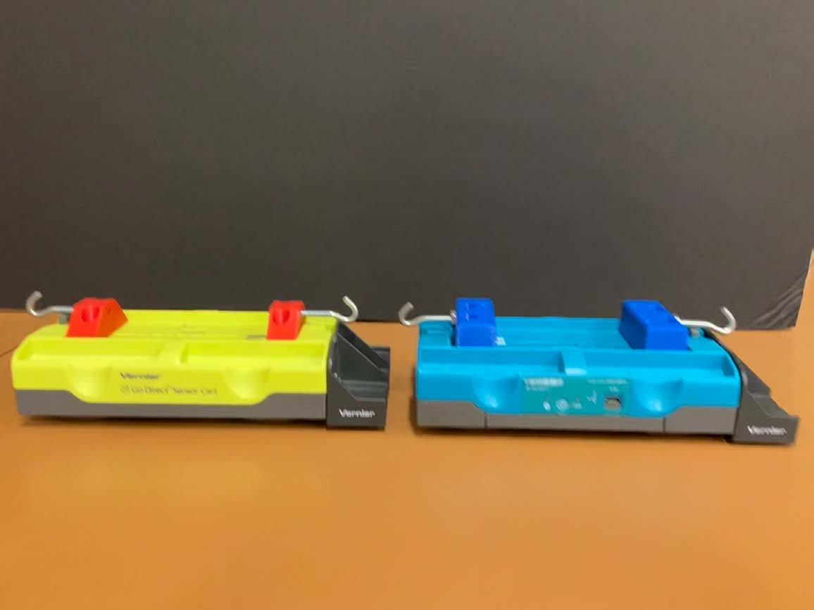
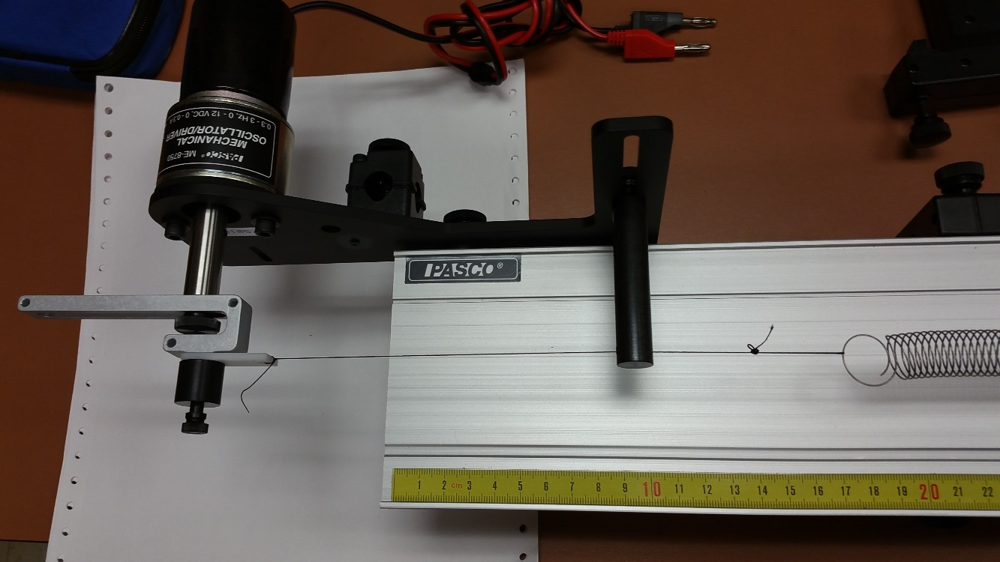
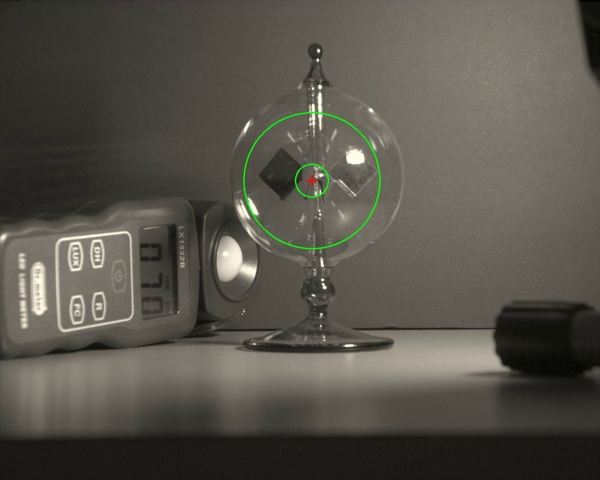
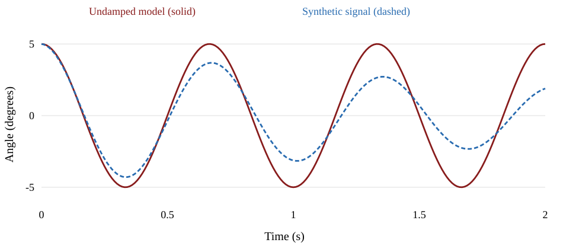

# Lecture 01 · Orientation and report writing

MIE 402 · Fall 2026 · September 9 · 50 minutes

[PowerPoint](site/docs/MIE402_Lecture01_Report_Writing_Fall2026_v1.pptx) · [PDF](site/docs/MIE402_Lecture01_Report_Writing_Fall2026_v1.pdf) · [Report template](site/docs/MIE402_Report_Template.docx)

## 01. Course orientation and laboratory reports

**MIE 402.** Mechanical Engineering Laboratory II

**Fall 2026.** Prof. Ehsan Roohi · September 9, 2026

## 02. Experimental evidence and engineering judgment

**Observe and measure.** Identify the behavior, then record it with a documented measurement system.

**Compare and communicate.** Test the model against data and explain what the evidence supports.

## 03. Today’s 50-minute session

**0–8 min.** Course organization and the laboratory workflow

**8–23 min.** Six experiments, apparatus, measurements, and analysis

**23–42 min.** Report structure, figures, comparison, and uncertainty

**42–48 min.** Policies and a short report exercise

**48–50 min.** First dates and preparation

## 04. People, places, and weekly rhythm

**Instructor.** Prof. Ehsan Roohi · roohie@umass.edu · Gunness Laboratory, Room 1

**Graduate teaching assistants.** Yuyuan Zhang and Nazila Emamdoost

**Theory.** Monday, 12:20–1:10 PM · Hasbrouck Laboratory 134

**Laboratory / office hours.** Lab sections: Tuesday–Friday, Gunness Laboratory 5. Office hours: Friday, 12:20–1:10 PM, Gunness Laboratory 1.

## 05. Course grading

| Component | Weight |
| --- | --- |
| Six pre-labs, equally weighted | 20% |
| Lab 1 report | 10% |
| Combined Labs 2 and 3 report | 25% |
| Combined Labs 4 and 5 report | 25% |
| Lab 6 report | 15% |
| Participation | 5% |

## 06. The laboratory workflow

**Before the section.** Read the procedure, prepare the model, and submit the pre-lab.

**During the section.** Save raw data, settings, initial conditions, and observations.

**After the section.** Process the data, compare with theory, and explain the result.

## 07. Six experiments and four reports

| Lab | Experiment | Report |
| --- | --- | --- |
| 1 | Dynamic data sampling and frequency analysis | Lab 1 |
| 2 | Single pendulum | Labs 2 + 3 |
| 3 | Double pendulum | Labs 2 + 3 |
| 4 | 1-DOF system: free response | Labs 4 + 5 |
| 5 | 1-DOF system: forced response | Labs 4 + 5 |
| 6 | Radiometer | Lab 6 |

## 08. Lab 1: Recording sound

**The question.** How often must we measure a sound to record its frequency correctly?

**The equipment.** The microphone turns sound into voltage. Moku:Go records that voltage as numbers.

**What you do.** Record several sounds. For a steady tone, repeat the recording at different sampling rates.

## 09. Lab 1: A recording can show the wrong frequency

**Two useful plots.** A waveform shows voltage versus time. A frequency spectrum shows which frequencies are present; MATLAB can calculate it with an FFT.

**What to look for.** With too few samples per cycle, the signal can appear to have a lower frequency. This is called aliasing.

**What goes in the report.** Compare recordings with their actual sampling rates and durations. Explain which settings gave a reliable frequency estimate.

*Saving as MAT makes the measurements easy to load in MATLAB. Changing the file format does not fix a poor recording.*

## 10. Lab 2: One pendulum

**The question.** Does a pendulum take the same time to swing when we release it from a larger angle?

**The equipment.** A pendulum, a high-speed camera, lighting, and a length reference. The camera records the moving rod.

**What you do.** Release it without pushing. Record small, medium, and large starting angles. Track its position in MATLAB.

## 11. Lab 2: Comparing the swing with a model

**The measurements.** Plot angle versus time. Measure the period over several swings and check whether the swing size decreases.

**The model.** The small-angle model simplifies the equation of motion. Compare it with the full model as the release angle increases.

**What goes in the report.** Overlay measured and predicted angles. Compare their periods and explain how the starting angle changes the agreement.

*Use the same starting angle, angle direction, and time origin in the measurement and simulation.*

## 12. Lab 3: Two connected pendulums

**The question.** How does adding a second moving link change the motion and our ability to predict it?

**The equipment.** Two connected links, a high-speed camera, and a tracking app that follows both moving joints.

**What you do.** Record one small-angle case and at least three large-angle cases. Write down both starting angles before each release.

## 13. Lab 3: Two angle records to explain

**The measurements.** Plot each link’s angle versus time. Notice how the two links speed up, slow down, and influence one another.

**The comparison.** Start the simulation with the measured angles. Compare both links over the same time interval.

**What goes in the report.** Show where the predictions agree and where they separate from the measurements. Check release conditions and tracking before explaining the difference.

*A small difference at release can grow during large motion. An irregular-looking trajectory alone does not prove chaos.*

## 14. Lab 4: A cart released between springs

**The question.** What controls how fast the cart moves back and forth, and how quickly that motion dies away?

**The equipment.** A cart on a track, springs, added masses, and magnetic brakes. A sensor records the cart position.

**What you do.** Measure mass and spring stiffness. Pull the cart away from rest and let go. Repeat after changing one setting at a time.

## 15. Lab 4: Swing time and fading motion

**Two features of the plot.** Peak spacing gives the period. The decrease in peak height shows how quickly the motion dies away.

**Expected trends.** More mass usually gives slower motion. Stiffer springs give faster motion. More damping makes the peaks decrease faster.

**What goes in the report.** Compare the cases using measured frequency and damping. State exactly what changed and connect each trend to the model.

*Keep other settings fixed when making a comparison. Include the mass of added brake parts in the total moving mass.*

## 16. Lab 5: A cart driven by a motor

**The question.** Why can the cart move much farther at some driving speeds than at others?

**The equipment.** A motor moves one spring end back and forth. The cart records position; a tachometer measures motor speed.

**What you do.** Compare three brief pushes. Then drive the cart at several speeds below and above its strongest response.

## 17. Lab 5: Response at different driving speeds

**After each speed change.** Wait until the motion settles into a repeating pattern. Measure the spring-end motion and the cart motion.

**The main graph.** Plot cart amplitude divided by input amplitude against driving frequency. A peak indicates resonance.

**What goes in the report.** Compare the measured curve with the model. Explain how mass, spring stiffness, and damping affect the response.

*Amplitude means the distance from the middle position to a peak. Keep peak and peak-to-peak measurements consistent.*

## 18. Lab 6: A radiometer under light

**The question.** How fast do the vanes turn under the light, and does that speed change as the device warms?

**The equipment.** A glass radiometer, LED light, light meter, fixed camera, and dark background.

**What you do.** Keep the setup still. Record a clear 60–90 second video and note light level, distance, and whether the device is already warm.

## 19. Lab 6: Rotation speed from video

**The measurement.** The program follows the vanes and adds up their rotation angle. The slope of angle versus time gives average speed.

**The useful comparison.** Compare the early and late parts of the same recording. Check whether the rotation speeds up, slows down, or stays nearly steady.

**What goes in the report.** Report speed in revolutions per minute (RPM), show the angle plot, and explain how lighting, warming, and tracking affect the result.

*Compare the same time window in each trial. Lux measures visible light level; it does not directly measure the heat absorbed.*

## 20. The structure of a laboratory report

**Required sections.** Abstract, Introduction, Method, Results, Comparison, Discussion, Conclusions, and References

**Supporting material.** Appendices are optional. Essential evidence belongs in the main report.

**Reader.** Write for an engineering student who has completed Dynamics and Fluid Mechanics.

## 21. Report length and section purpose

| Section | Template allocation | Main purpose |
| --- | --- | --- |
| Abstract | Maximum 10 lines | Purpose, method, key finding, implication |
| Introduction | 1 page | Theory, experiment, and testable objective |
| Method | 1 page | Enough detail to reproduce the measurement |
| Results | 3 pages including figures | Observed behavior and processed measurements |
| Comparison | 1 page | Prediction and experiment on the same basis |
| Discussion | 1 page | Discrepancies, uncertainty, and limitations |
| Conclusions | 1 page | Quantitative answer and the main lesson |

*References and optional appendices have no stated page limit. Follow any assignment-specific limit on Canvas.*

## 22. Introduction and method

**Introduction.** Explain what you want to test, why it matters, and which equation predicts the result. Define every symbol.

**Method.** Describe the equipment, calibration, recording settings, and what you changed between trials.

**Data processing.** Explain how you turned the raw measurements into your final numbers and plots. Another group should be able to repeat the steps.

*Example objective: test how release angle changes agreement with the small-angle pendulum model.*

## 23. An abstract with a clear numerical result

**Purpose and method.** We tested a small-angle pendulum prediction using angle histories from video.

**Key result.** The measured frequency was 1.47 Hz, compared with a predicted 1.50 Hz, a 2.0% difference.

**Meaning and limit.** The agreement supports the model for this case. The discrepancy requires an uncertainty assessment.

*Illustrative wording and invented teaching values. An actual abstract must use your own results. Maximum 10 lines.*

## 24. Results: what the measurements show

**Observation.** Describe the measured trend. Give the important values and their units.

**Evidence.** Use a figure or table that answers the question. State the test conditions and identify repeated trials.

**Origin of each curve.** Label measurements and simulations clearly. Explain any processing that changes the measured values.

*Example observation: successive positive displacement peaks decrease over time.*

## 25. Readable, exported figures

**Figure requirements.** Numbered figure, descriptive caption, axis labels with units, legible text, and clear legend.

**Export.** Use high-resolution PNG, EPS, or PDF. Do not use screenshots of MATLAB or Python figure windows.

**Final check.** Inspect the submitted PDF at the size the reader will use.

## 26. A figure that supports a comparison

*Figure 1. Illustrative angle histories: undamped model and synthetic decaying signal, 5° initial angle, 50 samples/s.*

## 27. Comparison: a fair test of the model

**Same conditions.** Use the same units, starting conditions, and time origin. State the model parameters.

**Useful numbers.** Compare a relevant quantity, such as period, frequency, or amplitude. Also show the curves together when useful.

**Where parameters came from.** State which values you measured, assumed, or adjusted to match the data. Test adjusted values on another trial when possible.

Relative discrepancy = | measured − predicted | / | predicted | × 100%

*Use an appropriate absolute or scaled metric when the predicted value is zero or very small.*

## 28. How close is close enough?

**Limits of the measurements.** A camera time setting, ruler scale, or tracking position can be slightly wrong. Repeated trials can also give different results.

**Limits of the model.** Mass or spring stiffness may be uncertain. A simple model may leave out friction or large-angle effects.

**A supported conclusion.** A 2% difference alone does not tell us whether the agreement is good. Compare it with the size of the measurement and model uncertainties.

Period = elapsed time / number of complete cycles

*Timing several cycles reduces the effect of choosing one peak slightly early or late.*

## 29. Discussion: explanations tied to evidence

**What you observed.** The measured swing gets smaller over time, while the model keeps the same swing size.

**A possible explanation.** Friction or air resistance could remove energy. This plot alone does not tell us how much each one contributes.

**A useful check.** Compare how quickly the motion fades in different setups. Test whether adding damping improves the prediction.

*Replace “human error” with a specific mechanism, its expected effect, and a way to check it.*

## 30. Conclusions, references, and appendices

**Conclusions.** Answer the objective with the key numerical result, supported limitation, and a useful improvement.

**References.** Cite sources where used. Include the lecture notes at minimum and list every cited source.

**Appendices.** Add supporting calculations or extra data only when needed. Keep essential evidence in the main text.

## 31. Combined reports connect related experiments

**Labs 2 and 3.** Compare one angle with two coupled angles. Discuss model assumptions, initial conditions, and the limits of prediction.

**Labs 4 and 5.** Relate free-response frequency and damping to the forced response. Account for configuration changes.

**Organization.** Use one abstract and conclusion, with experiment-specific subsections and an explicit synthesis.

*Suggested organization within the required template. Do not assume the page allowance doubles.*

## 32. The report rubric: ten equal criteria

| Each criterion is 10% of the report grade | What to check |
| --- | --- |
| Complete sections / overall aesthetic | Required organization and consistent formatting |
| Clear figures / abstract | Readable evidence and a concise, quantitative summary |
| Data analysis / introducing the theory | Traceable processing and defined governing equations |
| Introducing the experiment / comparison with theory | Physical context and a fair model-data comparison |
| Discussion / meaningful results | Evidence-based interpretation and an answer to the objective |

*This table groups the ten original rubric criteria into pairs. Each individual criterion remains worth 10%.*

## 33. Submission and integrity policies

**Pre-labs.** Normally posted on Canvas on the Monday before the laboratory. Due before your own section starts; late pre-labs are not accepted.

**Reports.** Due on Canvas at 11:59 PM. A report grade loses 25% for each day or partial day late.

**Integrity and verification.** Discuss approaches, but do not copy solutions or share MATLAB, Python, or Simulink source files. Be ready to explain your submitted work.

## 34. Three-minute report exercise

**Draft sentence.** “The frequency was 1.47. Theory was 1.50. The error was small because of human error.”

**Work with a neighbor.** Add units, calculate the discrepancy, and separate the observation from its interpretation.

**Then decide.** What information is missing before you can judge agreement? Suggest one check that would help.

*Invented teaching values. No submission is required for this in-class discussion.*

## 35. Exercise debrief

**Results and comparison.** The measured frequency was 1.47 Hz and the predicted frequency was 1.50 Hz. Their difference was 0.03 Hz, or 2.0% of the prediction.

**Discussion.** This discrepancy alone does not establish acceptable agreement. Timing and model-parameter uncertainties are needed.

**Useful next check.** Verify the time calibration and repeat the frequency estimate using a stated interval and method.

*Other specific, evidence-based checks can also be valid.*

## 36. The first dates

**September 9.** One-time Wednesday orientation. No laboratory in Weeks 1–2.

**September 14.** Measurement fundamentals

**September 21–25.** Lab 1 week. Pre-lab 1 is due before your own section.

**October 5.** Lab 1 report due on Canvas at 11:59 PM

## 37. Preparation for Lab 1

**Before Week 3.** Confirm your lab section and GTA. Arrange MATLAB and Simulink access. Read the released Lab 1 and pre-lab instructions.

**Bring to the laboratory.** A way to save and back up your raw data, and a record of your preparation.

**Exit question.** What evidence would you need before trusting a measured frequency?

